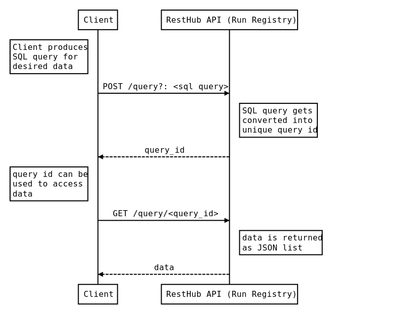
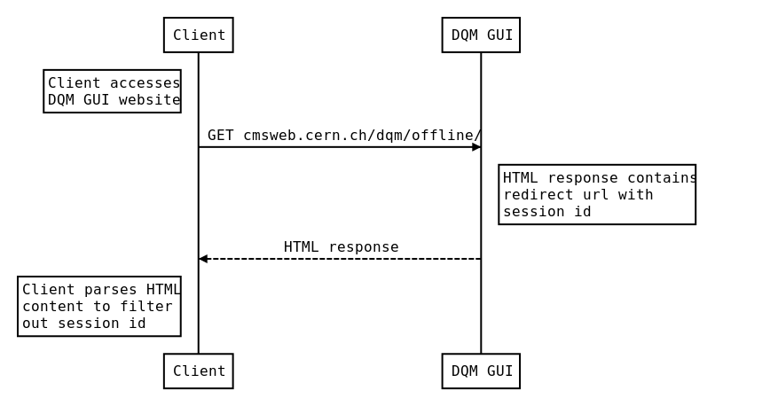
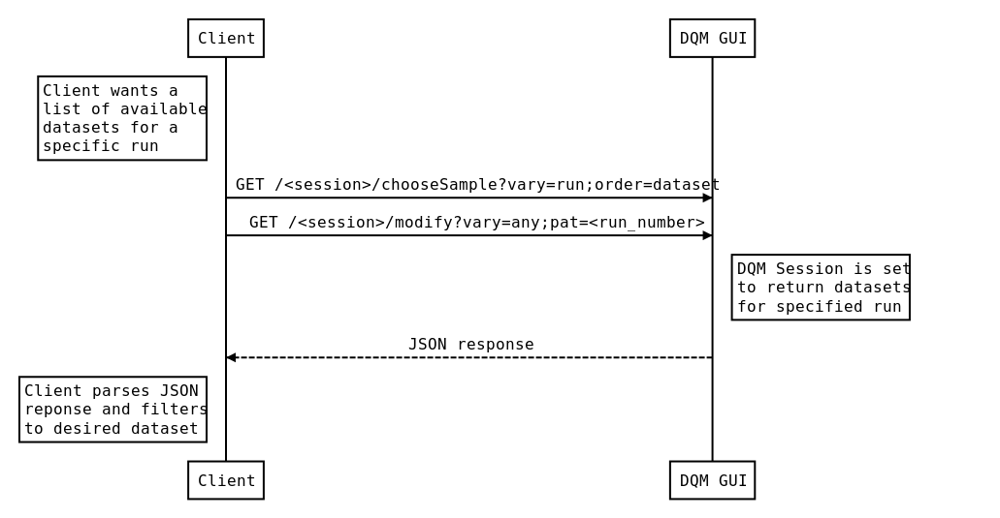

# cms-tracker-studies-notebook


## Prerequisites

This notebook was tested using ```Python``` version ```3.6```. 
Although other versions might work too, this is the only one tested.

Test your python version by running

```bash
python --version
```

```
Python 3.6.8
```

### Virtual environment

I highly recommend setting up a virtual environment to not get conflicts between different versions of packages.

You can create a virtual python virtual environment with:

```bash
python3 -m venv venv
```

Then you need to *activate* the virtual environment

```bash
. venv/bin/activate
```

You should now see a ```(venv) ``` in front of you terminal line.

```
(venv) [yourname@yourmachine cms-tracker-studies-notebook]$
```


### Installing packages

All tools necessary for data retrieval and data analysis are installable via ```pip```

*pip* comes bundled in Python 3.6 so, you should already have it installed.

These commands install all the tools necessary for this notebook:

```bash
pip install git+https://github.com/CMSTrackerDPG/cernrequests
pip install git+https://github.com/CMSTrackerDPG/runregcrawlr
pip install git+https://github.com/CMSTrackerDPG/dqmcrawlr
pip install git+https://github.com/CMSTrackerDPG/wbmcrawlr
pip install git+https://github.com/CMSTrackerDPG/runregistryclient
pip install git+https://github.com/ptrstn/cms-tracker-studies
pip install numpy
pip install matplotlib
pip install pandas
pip install seaborn
pip install scipy
pip install scikit-learn
```

*Side Note*: ```runregistryclient``` and ```cernrequests``` are also available in pypi, so you could also install it via:

```bash
pip install cernrequests
pip install runregistryclient
```

This would install the current stable version of the package, 
while the github link always installs the latest version inside the master branch of the repository.
In order to update the pypi package, a maintainer is necessary which will leave in April 2019.


## Authentication Setup

A lot of resources at CERN are only accessible with proper authentication. 
Some only require you to be within the CERN GPN, some require you to just authenticate with your Grid User Certificate, while others require cookies.
In general should [request a grid user certificate](https://ca.cern.ch/ca/), if you dont already have.
After that, you should have downloaded a file called ```myCertificate.p12```
Now this file needs to be converted into *public* and *private* key. You can do that using ```openssl```.
The tools for this notebook, assume that your public and private key are inside the ```private``` folder.
If you do not like this behavior you can change the path by exporting the ```CERN_CERTIFICATE_PATH``` environment variable as described [here](https://github.com/CMSTrackerDPG/cernrequests#configuration).

In general you can do the just described steps with:

```bash
mkdir -p ~/private
openssl pkcs12 -clcerts -nokeys -in myCertificate.p12 -out ~/private/usercert.pem
openssl pkcs12 -nocerts -in myCertificate.p12 -out ~/private/userkey.tmp.pem
openssl rsa -in ~/private/userkey.tmp.pem -out ~/private/userkey.pem
```

These commands should ask you for the user certificate password. 
In the simplest case, just enter them twice.

*Note*: Your private key ```userkey.pem``` and public key ```usercert.pem``` have to be **passwordless** for the tools to work.

## Data sources

### TkDQMDoctor

The TkDQMDoctor website (https://tkdqmdoctor.web.cern.ch), or also called *certification helper*, is a website to facilitate the certification activities of a shifter. 
It guides the user step by step through the certification process of a single run by providing checklists and automatic form validation.
At the end of the daily shift, a shifter can generate a shift summary which is required for submitting certifications.

The website is the first instance of data certification. 
After certifying the run, it will be put into the Run Registry with their corresponding Subcomponent status for *Pixel*, *Strip* and *Tracking*.

All of this data has to be entered manually by checking information from various websites. 
Unfortunately, this can lead to human errors like typos and misclicks. 
The website has some mechanisms to prevent most of the errors, but is not one hundred percent effective.
Sometimes data is also wrongly labeled or simply not updated when changed which is noticeable when comparing the subcomponent status between the Run Registry and the TkDQMDoctor.

This means that, although most of the data can be correct, it is still unreliable and should be avoided when running the analysis. 
More reliable sources of data are the Run Registry and the Web Based Monitoring (WBM) website.

This will change in the new version of the TkDQMDoctor, since all the data there will be retrieved automatically!

### Run Registry

The Run Registry stores the quality flags (*GOOD*/*BAD*/*EXCLUDED*) of each subcomponent for every run that needs to be certified. 

At the beginning of the year 2019 a new version of the Run Registry (Version 4) has been released. 
It will replace the old website (Version 3) during the course of the year 2019. 

### Web Based Monitoring

Web Based Monitoring (WBM) (https://cmswbm.cern.ch) is a web interface to gain access to useful information of the CMS detectors for any given run.
This information can be for example the beam conditions, the integrated luminosity, the number of colliding bunches and the number of pile up.
It is also possible the check if a subsystem is taking data and how the subcomponent quality flag for every single lumisections are set.
The website has an XML API, which is a little bit old and rather slow. 
For this reason, it will be replaced by the new *Online Monitoring System*.

### Online Monitoring System

The Online Monitoring System (OMS) (https://cmsoms.cern.ch/) was developed to replace the old Web Based Monitoring. 
It is very modern and responsive and most importantly has a robust working REST API.

### DQM GUI

The DQM GUI (Data Quality Monitor Graphical User Interface), is a web tool that provides histograms for any given. 
The DQM GUI is split into two services, *online* and *offline*.

The *online* service (http://cmsweb.cern.ch/dqm/online) is used to monitor data in real time, while the *offline* service (http://cmsweb.cern.ch/dqm/offline) provides a collection of information after data has been processed. 
This tool requires an authorized personal CERN grid certificate, which should be installed in the browser of the user.

## Tools

### cernrequests

A lot of resources at CERN are only accessible with proper authentication.
Making this process work inside tools can be tedious and will eventually lead to copy-and-pasted code which is often only partially understood.
Since logging in into websites to get access to any particular data is a common task, a tool or library which takes care of this process would drastically simplify the implementation of new tools.
```cernrequests``` was built to make the user think that no authentication is necessary at all.
Once configured correctly it will look for a [grid user certificate](https://ca.cern.ch/ca/) in the ```private``` or ```.globus``` folder of the home directory and handles all authentication and the root certificate validation.

```python
import cernrequests

url = "https://<your-cern-website>"
response = cernrequests.get(url)
```

HTTPS requests to CERN resources usually have to validate against a CERN Root Certificate Authority. 
Since most web browsers and operating system do not know about the CERN Root CA, they either have to be installed manually or provided otherwise. 
The ```cernrequests``` package takes the second approach, by including the CERN Root certificates, similar to the [certify](https://certifi.io) package that the python package [requests](http://docs.python-requests.org/en/master/) is using.

More information about ```cernrequests``` is available in the dedicated [GitHub repository CMSTrackerDPG/cernrequests](https://github.com/CMSTrackerDPG/cernrequests)

### runregcrawlr

```runregcrawlr``` is a tool to download data stored in the CERN CMS Run Registry (Version 3). 
The underlying API Client to the Run Registry had to be rewritten, to make it Python 3 compatible. 
A Python 2 client run registry client available at https://github.com/valdasraps/resthub.

Internally it communicates to a [RestHub](https://github.com/valdasraps/resthub) Server via SQL queries.



The SQL Query first has to be converted into a unique query id, which can then be used (and reused) to get a cached response of the desired data.

The Run Registry has its own API URL (http://vocms00170:2113), which must be accessed within the CERN General Purpose Network (GPN).

A detailed description of how to use the tool is available at the dedicated GitHub repository [runregcrawlr](https://github.com/CMSTrackerDPG/runregcrawlr).

### runregistryclient

```runregistryclient``` is a python client to the new CMS Run Registry (Version 4). 
It had to be reimplemented because the API completely changed. 
It is designed to be easy to use and not break on small API changes.
Because the new version of the Run Registry was not jet put in production during the time of writing this notebook it is not used here.

Authentication and Root Certificate validation is handled internally when configured correctly with the help of ```cernrequests```.

A detailed description of how to use the new run registry client is available at the dedicated GitHub repository [runregistryclient](https://github.com/CMSTrackerDPG/runregistryclient)

### wbmcrawlr

```wbmcrawlr``` was written to be able to download data from the CMS *Web Based Monitoring* (WBM) page and the successor *Online Monitoring System* (OMS) in a JSON format. 
In contrast to WBM, OMS has a well-implemented REST API that drastically simplifies and speeds up data retrieval in various formats.

Every table has its dedicated endpoint. 
The most important endpoints are:

| url                                               | Description  |
|---------------------------------------------------|--------------|
| http://cmsomsapi.cern.ch:8080/api/v1/runs         | Runs         |
| http://cmsomsapi.cern.ch:8080/api/v1/fills        | Fills        |
| http://cmsomsapi.cern.ch:8080/api/v1/lumisections | Lumisections |


Information about a specific run can be retrieved by appending the run number to the corresponding URL,

Examples:

| url                                                           | Description                                                         |
|---------------------------------------------------------------|---------------------------------------------------------------------|
| http://cmsomsapi.cern.ch:8080/api/v1/runs/327564              | Returns Run resource with the run number 327564 in JSON             |
| http://cmsomsapi.cern.ch:8080/api/v1/runs/327564/fill         | Returns fill information about the Run with the run number 327564   |
| http://cmsomsapi.cern.ch:8080/api/v1/runs/327564/lumisections | Returns list of lumisections for the Run with the run number 327564 |

```wbmcrawlr``` downloads all your desired data in a *flat* format, meaning that there are no nested lists. 
Additionaly some of the *meta* fields (like integrated luminoist unit) are also included into the dataset.

A detailed description of how to use the new run registry client is available at the dedicated GitHub repository [wbmcrawlr](https://github.com/CMSTrackerDPG/wbmcrawlr)

### dqmcrawlr

```dqmcrawlr``` provides a command line client, written in python, to download plots from the CMS DQM GUI for any given run.
It tries to guess the correct dataset name for a given reconstruction type (express, prompt, ...). 
It also automatically creates a DQM Session and authenticates the CERN User with the help of ```cernrequests```.

First, a DQM session string has to be obtained. 
This is done by visiting the website and parsing the HTML content containing redirect URL with the session ID.



This session string can then be reused to retrieve all the desired plots. 
The next step is to choose the correct dataset name for a given reconstruction type and run number. 
This procedure is illustrated in this figure:



Having both a session string and the dataset name, you can now retrieve the desired histogram via the ```jsonfairy``` API which follows the following pattern:

```
https://cmsweb.cern.ch/dqm/offline/jsonfairy/archive/<run_number>/<dataset>/<plot_name>
```

An example for a plot_name is:

```
/Tracking/TrackParameters/generalTracks/GeneralProperties/TrackEtaPhi_ImpactPoint_GenTk
```

A detailed description and the source code is available at the dedicated GitHub page [dqmcrawlr](https://github.com/CMSTrackerDPG/dqmcrawlr)

## Data retrieval

The first thing that you want to do is decide which runs you want to study. 
It can either be a list of specific run numbers or (better) a run number range.
The Runs of the year 2018 have a run number range of ```313052``` to ```327564```.

Now you should create a dedicated folder for all your ```data```.

```bash
mkdir data
cd data
```

Once you are inside the ```data``` folder you can start downloading the runs.

### Run Registry (Version 3)

The ```runregcrawl``` cli script allows retrieval of data from the Run Registry (version 3).

To download all certified runs in the year 2018 from the tracker workspace you can do:

```bash
runregcrawl --workspace tracker --exclude-cosmics --exclude-non-regular --min 313052 --max 327564
```

Output:

```
Using Tracker workspace
Stored 2225 entries in file 'runregcrawlr-tracker-output.json'
```

```--exclude-cosmics``` will exclude *Cosmics* runs and ```--exclude-non-regular``` will exclude *special* and *commisioning* runs.

If you get a Error message saying:

```bash
requests.exceptions.HTTPError: 500 Server Error: Internal Server Error for url: http://vocms00170:2113/query
```

Then, just wait like 10 minutes and try it again. 
I do not know why this happens.

```--workspace tracker``` tells the client to only download data from the *Tracker* workspace. 

For this notebook we focus on all runs from the *Tracker* and *Global* workspace.

```bash
runregcrawl --workspace tracker --min 313052 --max 327564
runregcrawl --workspace global --min 313052 --max 327564
```

*Note*: The Run registry (Version 3) API is only accessible within the CERN GPN. 
So you need to within use tunneling and get the data within *lxplus*

### Run Registry (Version 4)

Since the new run registry has not been used yet in production, i will only provide the instructions on how to get data from it. 
I have not yet tested how the data works in the final pandas data frame.

If you want a single run, do this:

```python
import runreg

runreg.get(run_number=327600)
```

If you prefer a non-nested JSON output, use the ```flat=True``` parameter.

```python
import runreg

runreg.get(run_number=327600, flat=True)
```

If you want to use several filters at once, for example, to filter according to a sequence number range with certain criteria, you can do it this way:

```python
import runreg

runreg.get(run_number=[(327596, ">="), (327744, "lte")], name=("%Cosmics%", "like"))
```

Or if you prefer Django like lookup fields:

```python
import runreg

runreg.get(run_number__gte=327596, run_number__lte=327744, name__like="%Cosmics%")
```

*Note*: The Run Registry (Version 4) API should be (as of April 2019) accessible from anywhere in the world.

### TkDQMDoctor

If you want data from the TkDQMDoctor (version 1), you need to be at least a shift leader (status April 2019).
First you need to login using your CERN account at:

- https://tkdqmdoctor.web.cern.ch/accounts/login/

There are 3 data endpoints available.

| Description | URL | filename |
|-------------------------------------------------------|----------------------------------------------------|-------------------------------------|
| All runs | https://tkdqmdoctor.web.cern.ch/json/runs/ | ```tkdqmdoctor_runs.json``` |
| All runs that are categorized with a problem category | https://tkdqmdoctor.web.cern.ch/json/problem_runs/ | ```tkdqmdoctor_problem_runs.json``` |
| All available problem categories | https://tkdqmdoctor.web.cern.ch/json/problems/ | ```tkdqmdoctor_problems.json``` |

The endpoints data should be saved as the stated in the ```filename``` column. All 3 json files should be put into the ```data``` folder.

The most interesting attributes of this data are probably ```comment```, ```reference_run__reference_run``` (reference run number) and ```problem_names``` (list of problem categories).

### DQM GUI

Plots from the DQM GUI can be retrieved with the ```dqmcrawl``` command line script.
This script requires a ```runs.txt``` file, containing a list of run numbers and reconstruction types.
Each line of this file should contain one run number and one reconstruction type (e.g. Online, Express, Prompt, ReReco).

This file could look like this:

```
321012 Express
321012 Online
325310 Prompt
321012 Express
306631 reReco
306631 Express
```

You can generate this file using ```runregcrawl```:

```bash
runregcrawl --workspace tracker --runs-txt --min 313052 --max 327564
```

which will output a ```runs.txt``` file containing all runs in the tracker workspace within the specified run number range.

Then you can use this file to download DQM Plots.

First you need the name of the plot that you want to download. 
One example for this could be ```/Tracking/TrackParameters/GeneralProperties/TrackEtaPhi_ImpactPoint_GenTk```.
Then to download the ```TrackEtaPhi_ImpactPoint_GenTk``` histogram for all runs specified in the ```runs.txt``` file you can do:

```bash
dqmcrawl runs.txt --resource "/Tracking/TrackParameters/GeneralProperties/TrackEtaPhi_ImpactPoint_GenTk"
```

This will create a new folder called ```TrackEtaPhi_ImpactPoint_GenTk``` containing one json for for each line in the ```runs.txt``` file.

If you want to download all histograms from the Quick Collection of the *Tracking*, *Pixel* and *Strip* workspace, then check out the commands at https://github.com/CMSTrackerDPG/dqmcrawlr#quick-collections

*Note*:

The resource name is a little bit different between the *Online* and the *Offline* Service in the CMS GUI.
For example, the resource name of the tracking map lacks a "generalTracks" in the name.

Online name:

```/Tracking/TrackParameters/GeneralProperties/TrackEtaPhi_ImpactPoint_GenTk```

Offline name:

```/Tracking/TrackParameters/generalTracks/GeneralProperties/TrackEtaPhi_ImpactPoint_GenTk```


### Online Monitoring System (OMS)

Data from the OMS can be downloaded using the ```wbmcrawl``` cli script.

The python package ```wbmcrawlr``` can download both from the CMSWBM and the CMSOMS website API. 
The ```wbmcrawl``` command line script uses only the OMS API.

You can retrieve both runs and fills, but also many other things like lumisections and hltrates.

To download all runs for the year 2018 execute following command:

```bash
wbmcrawl --runs 313052 327564
```

Output:

```bash
Getting runs 313052 - 327564 from CMS OMS
Total number of runs: 6424

[#################---------------------------------] 33.85% Page 22/65
```

This will create a file ```oms_runs.json``` containing the list of specified runs.

Analogously LHC fills can be downloaded:


```bash
wbmcrawl --fills 7480 7483
```

Output:

```bash
Getting fills 7480 - 7483 from CMS OMS
Total number of fills: 4

[##################################################] 100.00% Page 1/1

Stored 4 fills in 'oms_fills.json'
```

This will create a fille ```oms_fills.json```, containing a list of the specified fills.

For more details check out the [GitHub repository](
A detailed description of how to use the new run registry client is available at the dedicated GitHub repository [wbmcrawlr](https://github.com/CMSTrackerDPG/wbmcrawlr)).


## Load data

### TkDQMDcotor

Requires:

 - ```data/tkdqmdoctor_runs.json```
 - ```data/tkdqmdoctor_problem_runs.json```

```python
from trackerstudies.load import load_tkdqmdoctor_runs, load_tkdqmdoctor_problem_runs

tkdqmdoctor_runs = load_tkdqmdoctor_runs()
tkdqmdoctor_problem_runs = load_tkdqmdoctor_problem_runs()
```

### Run Registry

Requires:

 - ```data/runregcrawlr-tracker-output.json```
 - ```data/runregcrawlr-global-output.json```
 
```python
from trackerstudies.load import load_tracker_runs, load_online_tracker_runs

tracker_runs = load_tracker_runs()
tracker_online_runs = load_online_tracker_runs()
```

### Online Monitoring System (OMS)

Requires:

 - ```data/oms_runs.json```
 - ```data/oms_fills.json```

```python
from trackerstudies.load import load_oms_runs, load_oms_fills
from trackerstudies.merge import merge_oms_runs_oms_fills

oms_runs = load_oms_runs()
oms_fills = load_oms_fills()
oms_runs = merge_oms_runs_oms_fills(oms_runs, oms_fills)
```

### DQM GUI Histograms


Requires:

 - ```data/<histogram_folder>/<run_number>_<reco>.json```

#### Load a specific histogram

To load a specific histogram, in this case ```NumberOfRecHitsPerTrack_GenTk```, do:

```python
from trackerstudies.load import read_histogram_folder

histograms = read_histogram_folder("NumberOfRecHitsPerTrack_GenTk", attribute_prefix="hits")
```

```attribute_prefix``` is used as a abbreviation for the feature column name.

This function will extract:

 - rms
 - mean 
 - integral
 - number of entries

If you want the content of a histogram check out the ```load_track_histograms``` function, change your code accordingly. 

#### Load Quick Collection

Requires

 - https://github.com/ptrstn/dqmcrawlr#quick-collections

To load the histograms from the quick collection (PixelPhase1, Strip, Tracking):

```python
from trackerstudies.load import load_all_histogram_folders

histograms = load_all_histogram_folders()
```

### Merge all data

```python

from trackerstudies.load import (
    load_tracker_runs,
    load_tkdqmdoctor_runs,
    load_oms_runs,
    load_tkdqmdoctor_problem_runs,
    load_all_histogram_folders,
    load_online_tracker_runs,
    load_oms_fills
)

from trackerstudies.merge import (
    merge_runreg_tkdqmdoc,
    merge_runreg_oms,
    merge_runreg_runreg,
    merge_runreg_tkdqmdoc_problem_runs,
    merge_runreg_histograms,
    merge_oms_runs_oms_fills,
)

tracker_runs = load_tracker_runs()
tracker_online_runs = load_online_tracker_runs()
tkdqmdoctor_runs = load_tkdqmdoctor_runs()
tkdqmdoctor_problem_runs = load_tkdqmdoctor_problem_runs()
oms_runs = load_oms_runs()
oms_fills = load_oms_fills()
oms_runs = merge_oms_runs_oms_fills(oms_runs, oms_fills)
histograms = load_all_histogram_folders()


runs = (
    tracker_runs.pipe(merge_runreg_runreg, tracker_online_runs)
    .pipe(merge_runreg_tkdqmdoc, tkdqmdoctor_runs)
    .pipe(merge_runreg_tkdqmdoc_problem_runs, tkdqmdoctor_problem_runs)
    .pipe(merge_runreg_oms, oms_runs)
    .pipe(merge_runreg_histograms, histograms)
).sort_values(by=["run_number", "reco"])
```

Addiotionally you can add some extra columns

```python
from trackerstudies.load import (
    load_tracker_runs,
    load_tkdqmdoctor_runs,
    load_oms_runs,
    load_tkdqmdoctor_problem_runs,
    load_all_histogram_folders,
    load_online_tracker_runs,
    load_oms_fills
)

from trackerstudies.merge import (
    merge_runreg_tkdqmdoc,
    merge_runreg_oms,
    merge_runreg_runreg,
    merge_runreg_tkdqmdoc_problem_runs,
    merge_runreg_histograms,
    merge_oms_runs_oms_fills,
)

from trackerstudies.pipes import (
    add_runtype,
    add_is_bad,
    add_reference_cost,
    add_is_heavy_ion,
    add_is_commissioning,
    add_is_special,
    add_status_summary,
    add_bad_reason,
)

tracker_runs = load_tracker_runs()
tracker_online_runs = load_online_tracker_runs()
tkdqmdoctor_runs = load_tkdqmdoctor_runs()
tkdqmdoctor_problem_runs = load_tkdqmdoctor_problem_runs()
oms_runs = load_oms_runs()
oms_fills = load_oms_fills()
oms_runs = merge_oms_runs_oms_fills(oms_runs, oms_fills)
histograms = load_all_histogram_folders()


runs = (
    tracker_runs.pipe(merge_runreg_runreg, tracker_online_runs)
    .pipe(merge_runreg_tkdqmdoc, tkdqmdoctor_runs)
    .pipe(merge_runreg_tkdqmdoc_problem_runs, tkdqmdoctor_problem_runs)
    .pipe(merge_runreg_oms, oms_runs)
    .pipe(merge_runreg_histograms, histograms)
    .pipe(add_runtype)
    .pipe(add_is_special)
    .pipe(add_is_commissioning)
    .pipe(add_is_bad)
    .pipe(add_is_heavy_ion)
    # .pipe(add_all_problems)
    .pipe(add_status_summary)
    .pipe(add_bad_reason)
).sort_values(by=["run_number", "reco"])
```

For this exact behaviour there is a shortcut utility function:

```python
from trackerstudies.utils import load_runs()

runs = load_runs()
```


## tl;dr

*aka just tell me what to do*

Download your grid user certificate and then execute following bash commands (this will take a while):

### Setup 

```bash
python3 -m venv venv
. venv/bin/activate
pip install git+https://github.com/CMSTrackerDPG/cernrequests
pip install git+https://github.com/CMSTrackerDPG/runregcrawlr
pip install git+https://github.com/CMSTrackerDPG/dqmcrawlr
pip install git+https://github.com/CMSTrackerDPG/wbmcrawlr
pip install git+https://github.com/CMSTrackerDPG/runregistryclient
pip install git+https://github.com/ptrstn/cms-tracker-studies
pip install numpy
pip install matplotlib
pip install pandas
pip install seaborn
pip install scipy
pip install scikit-learn
mkdir -p ~/private
openssl pkcs12 -clcerts -nokeys -in myCertificate.p12 -out ~/private/usercert.pem
openssl pkcs12 -nocerts -in myCertificate.p12 -out ~/private/userkey.tmp.pem
openssl rsa -in ~/private/userkey.tmp.pem -out ~/private/userkey.pem
```

### Get Data

```bash
mkdir -p data
cd data
FIRST_RUN_NUMBER=317500 # your first run number
LAST_RUN_NUMBER=317600  # your last run number
FIRST_FILL_NUMBER=6762  # your first fill number (based on run)
LAST_FILL_NUMBER=6769   # your last fill number (based on run)
wget https://raw.githubusercontent.com/ptrstn/cms-tracker-studies-notebook/master/tldr.sh
source ../tldr.sh       # Warning: This will take a while
cd ..                   # Go back to your projects root folder
```

Login at https://tkdqmdoctor.web.cern.ch/accounts/login/ and then download

 - https://tkdqmdoctor.web.cern.ch/json/runs/ as ```'data/tkdqmdoctor_runs.json```
 - https://tkdqmdoctor.web.cern.ch/json/problem_runs/ as ```'data/tkdqmdoctor_problem_runs.json```

### Create Pandas Data Frame

Shortcut for lazy people (requires the steps above):

```python
from trackerstudies.utils import load_runs

runs = load_runs()  # First time will take a while, next time is cached
```

## Run principal component analysis

```python
from trackerstudies.utils import load_runs
from sklearn.decomposition import PCA
from sklearn.preprocessing import StandardScaler
from sklearn.covariance import EllipticEnvelope
from sklearn.manifold import TSNE
from sklearn import svm
import pandas
import seaborn as sns
import matplotlib.pyplot as plt
import numpy as np
import numpy

# Load the pandas dataframe
runs = load_runs()          # First time will take a while

runs = runs.loc[runs.fill__era=="2018D", :]
runs = runs.loc[runs.reco.isin(['express', 'prompt']), :]
runs = runs.loc[runs['Hits.Pixel.mean'] > 0, :]
runs = runs.loc[runs['Hits.Strip.mean'] > 0, :]

runs.tracking = pandas.Categorical(runs.tracking, ["GOOD", "BAD"])
runs.bad_reason.fillna("GOOD", inplace=True)

runs.reset_index(inplace=True)   # Reset index

# Decide what features you want
column_names = list(runs) 
feature_tokens = ['.rms', 'mean']  # Only features for the RMS and mean value of histograms
my_feature_list = [column 
    for column in column_names 
    if any(token in column 
    for token in feature_tokens)
    or column in ['recorded_lumi']
]  # List of feature column names

# Extract feature matrix
feature_df = runs[my_feature_list].copy()
feature_df.fillna(0, inplace=True)          # Handle missing values
feature_df.reset_index(inplace=True)        # Reset Index
X = feature_df.loc[:, :].values             # Create feature matrix

# Extract labels
label_column_names = ['run_number', 'fill_number', 'reco', 'fill__era', 'pixel', 'strip', 'tracking', 'bad_reason']
labels = runs[label_column_names]

y = runs.tracking.cat.codes
#y = pandas.Categorical(runs.tracking, ["GOOD", "BAD"]).codes

# Feature scaling
X = StandardScaler().fit_transform(X)

## PCA
number_of_principal_components = 2
pca = PCA(n_components=number_of_principal_components)
classifier = pca.fit(X)
principal_components = classifier.transform(X)
variance_ratio = sum(pca.explained_variance_ratio_)

## Create a PCA Dataframe
pca_df = pandas.DataFrame(principal_components, columns=['pc1','pc2'])
pca_df = pandas.concat([pca_df, labels], axis=1)
pca_df.sort_values(["tracking", "run_number"], inplace=True)

bad_reason_colors = [
    (0.7019607843137254, 0.7019607843137254, 0.7019607843137254),
    (0.6509803921568628, 0.807843137254902, 0.8901960784313725),
    (0.12156862745098039, 0.47058823529411764, 0.7058823529411765),
    (0.6980392156862745, 0.8745098039215686, 0.5411764705882353),
    (0.2, 0.6274509803921569, 0.17254901960784313),
    (0.984313725490196, 0.6039215686274509, 0.6),
    (0.8901960784313725, 0.10196078431372549, 0.10980392156862745),
    (0.9921568627450981, 0.7490196078431373, 0.43529411764705883),
    (1.0, 0.4980392156862745, 0.0),
    (0.792156862745098, 0.6980392156862745, 0.8392156862745098),
    (0.41568627450980394, 0.23921568627450981, 0.6039215686274509),
    (1.0, 1.0, 0.6),
    (0.6941176470588235, 0.34901960784313724, 0.1568627450980392),
]

## Plot the PCA DF
ax = sns.scatterplot(x="pc1", y="pc2", hue="bad_reason", data=pca_df)
plt.title("Principal Component Analysis ({:.2%})".format(variance_ratio))
plt.savefig("pca.png")
plt.show()


##################################
# Running the classifiers
##################################

X = principal_components

## Extract all runs that are certified good and bad
good_df = pca_df[pca_df.tracking=="GOOD"]
bad_df = pca_df[pca_df.tracking=="BAD"]

## Create Feature matrix and split by good and bad
pca_features = ['pc1','pc2']
X_good = good_df.loc[:, pca_features].values
X_bad = bad_df.loc[:, pca_features].values


##################################
# Two class support vector machine 
##################################

## Traing binary SVM classifier
svm_classifier = svm.SVC(gamma='scale')
svm_classifier.fit(X, y)

## Create a grid to draw the classifier
xx, yy = np.meshgrid(np.linspace(-20, 25, 500), np.linspace(-10, 35, 500))
Z = svm_classifier.decision_function(np.c_[xx.ravel(), yy.ravel()])
Z = Z.reshape(xx.shape)

## Draw the boundary
plt.contourf(xx, yy, Z, levels=np.linspace(Z.min(), 0, 10), cmap=plt.cm.PuBu)
a = plt.contour(xx, yy, Z, levels=[0], linewidths=2, colors='darkred')
plt.contourf(xx, yy, Z, levels=[0, Z.max()], colors='palevioletred')

## Draw the data points
b1 = plt.scatter(X_good[:, 0], X_good[:, 1], c='blueviolet', edgecolors='k')
b2 = plt.scatter(X_bad[:, 0], X_bad[:, 1], c='gold', edgecolors='k')
plt.title("Support Vector Machine (Two Class)")
plt.savefig("svm_twoclass.png")
plt.show()

##################################
# One class Suport vector machine 
##################################

## Traing SVM classifier
nu = 0.07
gamma = "scale"
svm_classifier = svm.OneClassSVM(nu=nu, kernel="rbf", gamma=gamma)
svm_classifier.fit(X_good)

## Create a grid to draw the classifier
xx, yy = np.meshgrid(np.linspace(-20, 25, 500), np.linspace(-10, 35, 500))
Z = svm_classifier.decision_function(np.c_[xx.ravel(), yy.ravel()])
Z = Z.reshape(xx.shape)

## Draw the boundary
plt.contourf(xx, yy, Z, levels=np.linspace(Z.min(), 0, 10), cmap=plt.cm.PuBu)
a = plt.contour(xx, yy, Z, levels=[0], linewidths=2, colors='darkred')
plt.contourf(xx, yy, Z, levels=[0, Z.max()], colors='palevioletred')

## Draw the data points
b1 = plt.scatter(X_good[:, 0], X_good[:, 1], c='blueviolet', edgecolors='k')
b2 = plt.scatter(X_bad[:, 0], X_bad[:, 1], c='gold', edgecolors='k')
plt.title("Support Vector Machine (One Class)")
plt.savefig("svm_oneclass.png")
plt.show()


##################################
# Robust covariance 
##################################

## Train robust covariance classifier
outliers_fraction = 0.05
robust_classifier = EllipticEnvelope(contamination=outliers_fraction)
robust_classifier.fit(X)

## Create a grid to draw the classifier
xx, yy = np.meshgrid(np.linspace(-20, 25, 500), np.linspace(-10, 35, 500))
Z = robust_classifier.decision_function(np.c_[xx.ravel(), yy.ravel()])
Z = Z.reshape(xx.shape)

## Draw the boundary
plt.contourf(xx, yy, Z, levels=np.linspace(Z.min(), 0, 10), cmap=plt.cm.PuBu)
a = plt.contour(xx, yy, Z, levels=[0], linewidths=2, colors='darkred')
plt.contourf(xx, yy, Z, levels=[0, Z.max()], colors='palevioletred')

## Draw the data points
b1 = plt.scatter(X_good[:, 0], X_good[:, 1], c='blueviolet', edgecolors='k')
b2 = plt.scatter(X_bad[:, 0], X_bad[:, 1], c='gold', edgecolors='k')
plt.title("Robust Covariance")
plt.savefig("robust_covariance.png")
plt.show()

##################################
# t-SNE
##################################

# Decide what features you want
column_names = list(runs) 
feature_tokens = ['.rms', 'mean',]  # Only features for the RMS and mean value of histograms
my_feature_list = [column 
    for column in column_names 
    if any(token in column 
    for token in feature_tokens)
    and "charge" in column
    or column in ['recorded_lumi', 'delivered_lumi']
]  # List of feature column names

# Extract feature matrix
feature_df = runs[my_feature_list].copy()
feature_df.fillna(0, inplace=True)          # Handle missing values
X = feature_df.loc[:, :].values             # Create feature matrix

X = StandardScaler().fit_transform(X)

tsne = TSNE()
tsne_components = tsne.fit_transform(X)

tsne_df = pandas.DataFrame(tsne_components, columns=['tsne1','tsne2'])

big_df = pandas.concat([runs, tsne_df], axis=1)

ax = sns.scatterplot(
    "tsne1", "tsne2", hue='tracking', data=big_df
)
ax.set_title("t-SNE")
plt.savefig("t-sne.png")
plt.show()

##################################
# t-SNE on PCA
##################################

# Decide what features you want
column_names = list(runs) 
feature_tokens = ['.rms', 'mean',]  # Only features for the RMS and mean value of histograms
my_feature_list = [column 
    for column in column_names 
    if any(token in column 
    for token in feature_tokens)
    or column in ['recorded_lumi']
]  # List of feature column names

# Extract feature matrix
feature_df = runs[my_feature_list].copy()
feature_df.fillna(0, inplace=True)          # Handle missing values

X = feature_df.loc[:, :].values             # Create feature matrix

# Feature scaling
X = StandardScaler().fit_transform(X)

## PCA
number_of_principal_components = 5
pca = PCA(n_components=number_of_principal_components)
principal_components = pca.fit_transform(X)

# TSNE
tsne = TSNE()
tsne_components = tsne.fit_transform(principal_components)

tsne_df = pandas.DataFrame(tsne_components, columns=['tsne1','tsne2'])

big_df = pandas.concat([runs, tsne_df], axis=1)

ax = sns.scatterplot(
    "tsne1", "tsne2", hue='bad_reason', data=big_df
)
ax.set_title("t-SNE on PCA")
plt.savefig("t-sne_on_pca.png")
plt.show()
```